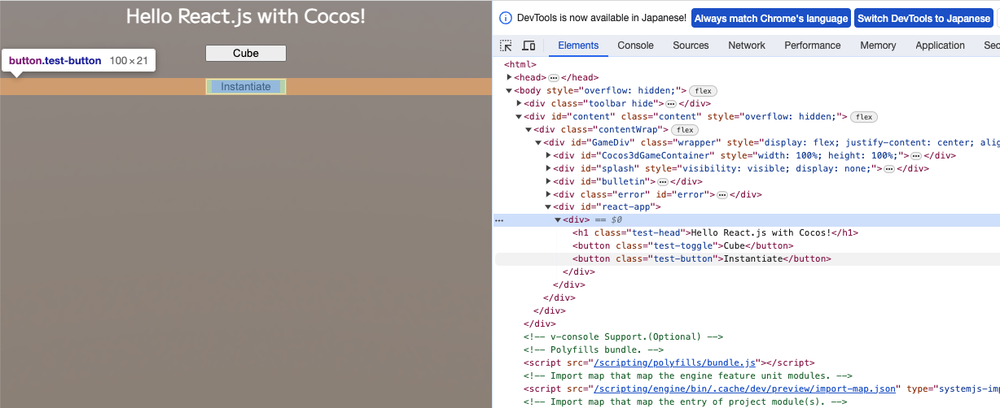

# React.js with Cocos Creator
[Japanese](./README_JP.md)



This is a sample project configured to use React and JSX syntax for web application development with CocosCreator, aimed at creating the UI solely with HTML/CSS.

It's only applicable for HTML5 builds. This sample has integrated Capacitor to enable outputs for iOS/Android native and includes support for SafeArea as well.

## Demo

[Web Mobile Demo](https://amagamina.jp/react-with-cocos-demo/)

## Environment
Cocos Creator 3.8.1

## Notes
It works in a browser preview, but you cannot click on HTML elements during an in-editor preview. Currently, there is no known workaround, so the use of CocosInspector is recommended if you're incorporating React.

Support for CSS frameworks is not included. Individual adjustments may be necessary for each framework, and compatibility issues may arise.

## Installation
1. Download the project and open it with CocosCreator.
2. Execute npm install.
3. Run npm run react when editing React components (changes will be detected automatically thereafter).

## About npm run react
JSX syntax for js or ts files is not supported in the Cocos test environment.

To address this, we've decided to use Babel to convert files written in JSX into js that can be interpreted by Babel.

Ideally, we would like to detect changes in the Cocos Editor and execute Babel, but for now, we place files under `react-src/` and start monitoring with the execution of `npm run react`. Any changes will result in the converted files being output under `assets/react-dist.`

The converted files will always be in JavaScript, but we change the extension to ts. If we don't do this, importing them as modules into other TypeScript files doesn't work well.

Even if you write in ts/tsx, the type information will be lost, but on the IDE, referencing the files on the src side allows IntelliSense to function.

If a new file is added and the extension conversion timing doesn't match, a js file may remain, so if it doesn't work properly, re-running npm run react will delete and then regenerate the contents under react-dist.

## About Changing Fonts
It's easy to reflect the specified font in CSS by setting and hiding a font in components such as Label, as Cocos will load that font on its side.

## Known Bugs
On iOS browsers (both Safari and Chrome), the clickable area of buttons becomes larger than it appears (unclear whether this is due to the combination of React and Cocos or a mistake in HTML/CSS).

## Manual Setup Guide
Here is some reference information for introducing React to your own projects without using this sample. This is just a method I found by trial and error, so there might be better ways.

### Required Packages (excluding Capacitor)
`package.json`
```json
  "dependencies": {
    "react": "^18.2.0",
    "react-dom": "^18.2.0"
  },
  "devDependencies": {
    "@babel/cli": "^7.23.4",
    "@babel/core": "^7.23.5",
    "@babel/plugin-syntax-jsx": "^7.23.3",
    "@babel/preset-react": "^7.23.3",
    "@babel/preset-typescript": "^7.23.3",
    "@types/react": "^18.2.39",
    "@types/react-dom": "^18.2.17",
    "chokidar": "^3.5.3"
  }
```


### tsconfig Settings
The name of the react-app part and the location of src are arbitrary.

```json
  "compilerOptions": {
    "strict": false,
    "allowSyntheticDefaultImports": true,
    "jsx": "react",
    "paths": {
      "react-app/*": [
        "./react-src/*"
      ],
      "react-app": [
        "./react-src/index.tsx"
      ]
    }
  }
```

### Create a Template
Create index.ejs via Cocos menu Project > Create Build Template > Web Mobile (or Desktop if using Desktop) and Create Web Preview Template.

Add the following line at the end of the body or elsewhere in each.

`preview-template/index.ejs`
```html
<script>window.process = { env: { NODE_ENV: 'development' } }</script>
```

`build-templates/web-mobile/index.ejs`
```html
  <% if (webDebuggerSrc) { %>
    <script>window.process = { env: { NODE_ENV: 'development' } }</script>
  <% } else { %>
    <script>window.process = { env: { NODE_ENV: 'production' } }</script>
  <% } %>
```

Since NODE_ENV is undefined in the browser execution environment, add this line to avoid errors.

### Configure the IDE to Look at the src Side's tsx Files
Use an import-map so that on the Cocos execution side, it looks at the dist side placed under assets.

`import-map.json`
```json
{
  "imports": {
    "react-app": "./assets/react-dist/index.ts",
    "react-app/": "./assets/react-dist/"
  }
}
```

Configure the created import-map in the ProjectSettings' Scripting item.

In tsconfig, as shown above, set the paths so that the IDE looks at the original files stored on the src side. This way, you can get the correct type information.

`tsconfig.json`
```json
  "compilerOptions": {
    ...
    "paths": {
      "react-app/*": [
        "./react-src/*"
      ],
      "react-app": [
        "./react-src/index.tsx"
      ]
    }
  }
```

### jsx→js Conversion
Prepare `.babelrc` after installing all the necessary packages.

```json
{
  "presets": [
    "@babel/preset-typescript",
    "@babel/preset-react"
  ]
}
```

Use the following command for conversion.

```sh
./node_modules/.bin/babel --extensions '.js,.ts,.jsx,.tsx' ./react-src/ -d ./assets/react-dist/ --watch
```

Since Babel always outputs with a js extension, create a process in nodejs to convert it to ts.

[ext-js-to-ts.js](https://github.com/ina-amagami/ReactWithCocos/blob/main/tools/ext-js-to-ts.js)
```js
const fs = require('fs');
const chokidar = require('chokidar');

const watcher = chokidar.watch('./assets/react-dist',
    {ignored: /^\./, persistent: true});

watcher.on('ready',function(){
    watcher.on('add', function(path) {
        if (path.endsWith('.js')) {
            const newPath = path.replace('.js', '.ts');
            fs.rename(path, newPath, err => {
                if (err) throw err;
            });
        }
    });
});
```

Since running this script and Babal at the same time may leave js files because Babel runs first, also prepare a script to delete everything except meta files from the dist directory first.

[clean-react-dist.js](https://github.com/ina-amagami/ReactWithCocos/blob/main/tools/clean-react-dist.js)
```js
const fs = require('fs');
const path = require('path');

const directory = './assets/react-dist';
const excludeExtension = '.meta';

fs.readdir(directory, (err, files) => {
    if (err) throw err;

    for (const file of files) {
        if (path.extname(file) !== excludeExtension) {
            fs.unlink(path.join(directory, file), err => {
                if (err) throw err;
            });
        }
    }
});
```

Add settings to package.json so you can run all of these simultaneously.

```json
  "scripts": {
    "react": "node ./tools/clean-react-dist.js & node ./tools/ext-js-to-ts.js & ./node_modules/.bin/babel --extensions '.js,.ts,.jsx,.tsx' ./react-src/ -d ./assets/react-dist/ --watch"
  },
```

Now npm run react will work for conversion. If it's okay to have the command split into two, splitting the scripts into two might be a good idea to avoid execution order problems.

### Load CSS
Since Cocos doesn't support css in file format, place it in the resources folder and apply it by loading it as a TextAsset at runtime.

```ts
import { resources, TextAsset } from 'cc';

resources.load('css/react', TextAsset, (err, asset) => {
    if (err) {
        console.error(err);
        return;
    }
    const style = document.createElement('style');
    style.appendChild(document.createTextNode(asset.text));
    document.head.appendChild(style);
});
```

While this is for one file, setting it up to load all css under a specified directory would make it easier to support various frameworks.

### Create a Root for React
The game's div element is prepared with the id GameDiv. This is the same in both the preview environment and after building, so create a root for React inside this element.

```ts
import ReactDOM from 'react-dom/client';

const gameDiv = document.getElementById('GameDiv');
const reactDiv = document.createElement('div');
reactDiv.id = 'react-app';
gameDiv.appendChild(reactDiv);
const root = ReactDOM.createRoot(reactDiv);
```

Example css

```css
#react-app {
    font-family: Mplus2-Regular_LABEL;
    position: absolute;
    top: var(--safe-area-top);
    right: var(--safe-area-right);
    bottom: var(--safe-area-bottom);
    left: var(--safe-area-left);
    display: block;
    pointer-events: none;
}
```

Please refer to the sample for settings related to SafeArea. If you are not accommodating for iOS/Android, using `width: 100%; height: 100%, top: 0;` is okay.

pointer-events is set to none. If not set this way, nothing can be clicked on the Cocos side.

For elements where input is desired below this, set pointer-events to auto.

### Rendering React Components
Render to the root that was created earlier.

```ts
import { ReactApp } from 'react-app';

root.render(ReactApp());
```

### Example of the Above ReactApp

`react-src/index.tsx`
```ts
import React from "react";

export const ReactApp: React.FC = () => {
    return (
        <div>
            <h1>Hello React.js with Cocos!</h1>
        </div>
    );
};
```