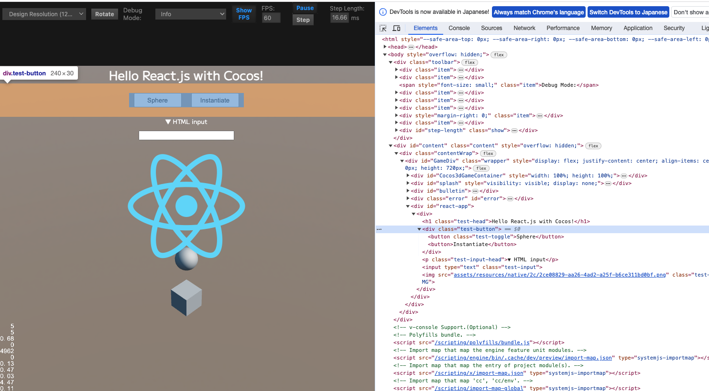

# React.js with Cocos Creator
[English](./README.md)



CocosCreatorを使用したWebアプリケーション開発で、UIのみHTML/CSSで作成することを目的としてReactとJSX記法を利用できるよう設定を行ったサンプルプロジェクトです。

HTML5ビルドのみを対象とするプロジェクトで有効です。このサンプルではiOS/Androidネイティブ向けにも出力できるよう[Capacitor](https://capacitorjs.jp/)を導入し、SafeAreaへの対応も行っています。

## 動作デモ

[Web Mobile Demo](https://amagamina.jp/react-with-cocos-demo/)

## 環境
Cocos Creator 3.8.1

## 注意点

- ブラウザプレビューでは動作しますが、エディタ内プレビュー時にHTML要素をクリックすることができません。今のところ対策方法が見つかっていないためReactを導入する場合は[CocosInspector](https://store.cocos.com/app/en/detail/2940)の併用を推奨します。
- CSSフレームワークへの対応は含まれていません。フレームワークごとに個別の対応が必要であったり、相性が良くない可能性もあります。

## 導入方法

1. プロジェクトをダウンロードしCocosCreatorで開く
2. ```npm install``` を実行
3. Reactコンポーネントを編集するとき ```npm run react``` を実行（以降は変更を自動検知）
4. CapacitorでiOS/Androidビルドを行う場合は `capacitor.config.json` のappIdを変更して下さい

## npm run react について

Cocosのテスト環境ではJSX記法を利用したjsやtsファイルはサポートしていません。

これに対処するため、JSXで記述したファイルをBabelで解釈可能なjsに変換して利用する方針を取りました。

理想としてはCocosエディタで変更を検知してBabelの実行を行いたいのですが、とりあえず```react-src/```以下にファイルを配置し、```npm run react```の実行で監視を開始し変更があったら```assets/react-dist```以下に変換後のファイルを出力しています。

また、変換後のファイルは必ずJavaScriptになりますが、拡張子をtsに変更しています。これを行わないと他のTypeScriptファイルにモジュールとしてインポートすることがうまくいかないためです。

ts/tsxで書いても型情報は消えてしまいますが、IDE上ではsrc側のファイルを参照することで、インテリセンスが機能するようにしています。

新しいファイルを追加すると拡張子の変換処理タイミングが合わずjsファイルが残ってしまうことがあるため、うまく動作しなかったら```npm run react```を再実行することで```react-dist```以下の中身が一旦削除されてから生成されます。

## フォントの変更について

Labelコンポーネントなどフォントを使うものに適当に設定して非表示にしておくと、Cocos側でそのフォントをロードしてくれるのでcss側でフォント名を指定すれば反映されてお手軽です。

## 画像の表示について

実行環境によりパスが異なるため、imgタグのsrc属性に直接パスを指定することは非推奨です。

assets以下に画像をインポートし、ImageAssetとして取得し`ImageAsset.nativeUrl`でパスを取得できます。

```ts
@property(ImageAsset)
private image: ImageAsset;

const props = {
    imgUrl: this.image.nativeUrl
}
root.render(reactApp(props));
```


## 既知バグ

- iOSのブラウザ（Safari, Chrome共通）でボタンを押せる範囲が見た目よりも大きくなってしまう（ReactとCocosの組み合わせによる挙動なのかHTML/CSS的なミスなのか不明）

## 手動セットアップ用の解説

このサンプルを使用せずにご自身のプロジェクトへReactを導入する際の参考情報として載せておきます。手探りで動く方法を見つけたという感じなのでもっと良い方法があるかもしれません。

### 必要なパッケージ（Capacitor以外）

`package.json`
```json
  "dependencies": {
    "react": "^18.2.0",
    "react-dom": "^18.2.0"
  },
  "devDependencies": {
    "@babel/cli": "^7.23.4",
    "@babel/core": "^7.23.5",
    "@babel/plugin-syntax-jsx": "^7.23.3",
    "@babel/preset-react": "^7.23.3",
    "@babel/preset-typescript": "^7.23.3",
    "@types/react": "^18.2.39",
    "@types/react-dom": "^18.2.17",
    "chokidar": "^3.5.3"
  }
```

### tsconfigの設定

react-appの部分の名前やsrcの置き場所は任意です

```json
  "compilerOptions": {
    "strict": false,
    "allowSyntheticDefaultImports": true,
    "jsx": "react",
    "paths": {
      "react-app/*": [
        "./react-src/*"
      ],
      "react-app": [
        "./react-src/index.tsx"
      ]
    }
  }
```

### テンプレートを作成

Cocosのメニュー Project > Create Build Template > Web Mobile（Desktopを使う場合はDesktop） と Create Web Preview Template でindex.ejsを作成します。

それぞれ行をbodyの最後などに追加します。

`preview-template/index.ejs`
```html
<script>window.process = { env: { NODE_ENV: 'development' } }</script>
```

`build-templates/web-mobile/index.ejs`
```html
  <% if (webDebuggerSrc) { %>
    <script>window.process = { env: { NODE_ENV: 'development' } }</script>
  <% } else { %>
    <script>window.process = { env: { NODE_ENV: 'production' } }</script>
  <% } %>
```

ブラウザ実行環境ではNODE_ENVが未定義につきこの記述を追加しないとエラーになります。

### IDEはsrc側のtsxファイルを見るように

import-mapを使用してCocos実行側ではassets以下に入れたdist側を見るようにします。

`import-map.json`
```json
{
  "imports": {
    "react-app": "./assets/react-dist/index.ts",
    "react-app/": "./assets/react-dist/"
  }
}
```

作成したimport-mapはProjectSettingsのScriptingの項目へ設定します。

tsconfigでは上でも載せたようにpathsを設定することで、IDE側はsrc側に格納した元ファイルを見るようになります。これで型情報を正しく得ることができます。

`tsconfig.json`
```json
  "compilerOptions": {
    ...
    "paths": {
      "react-app/*": [
        "./react-src/*"
      ],
      "react-app": [
        "./react-src/index.tsx"
      ]
    }
  }
```

### jsx→jsの変換

必要なパッケージをすべてインストールした上で`.babelrc`を用意します。

```json
{
  "presets": [
    "@babel/preset-typescript",
    "@babel/preset-react"
  ]
}
```

以下のコマンドで変換できます。

```sh
./node_modules/.bin/babel --extensions '.js,.ts,.jsx,.tsx' ./react-src/ -d ./assets/react-dist/ --watch
```

Babelでは必ず拡張子はjsで出力されてしまうので、tsに変換する処理はnodejsで作成します。

[ext-js-to-ts.js](https://github.com/ina-amagami/ReactWithCocos/blob/main/tools/ext-js-to-ts.js)
```js
const fs = require('fs');
const chokidar = require('chokidar');

const watcher = chokidar.watch('./assets/react-dist',
    {ignored: /^\./, persistent: true});

watcher.on('ready',function(){
    watcher.on('add', function(path) {
        if (path.endsWith('.js')) {
            const newPath = path.replace('.js', '.ts');
            fs.rename(path, newPath, err => {
                if (err) throw err;
            });
        }
    });
});
```

このスクリプトとBabalを同時に実行するとBabelが先に実行されてしまいjsファイルが残ることがあるため、最初にdistディレクトリ内からmetaファイル以外を削除するスクリプトも用意します。

[clean-react-dist.js](https://github.com/ina-amagami/ReactWithCocos/blob/main/tools/clean-react-dist.js)
```js
const fs = require('fs');
const path = require('path');

const directory = './assets/react-dist';
const excludeExtension = '.meta';

fs.readdir(directory, (err, files) => {
    if (err) throw err;

    for (const file of files) {
        if (path.extname(file) !== excludeExtension) {
            fs.unlink(path.join(directory, file), err => {
                if (err) throw err;
            });
        }
    }
});
```

これらをすべて同時に実行できるようにpackage.jsonに設定を加えます。

```json
  "scripts": {
    "react": "node ./tools/clean-react-dist.js & node ./tools/ext-js-to-ts.js & ./node_modules/.bin/babel --extensions '.js,.ts,.jsx,.tsx' ./react-src/ -d ./assets/react-dist/ --watch"
  },
```

これで `npm run react` を実行すると変換が動作するようになります。コマンドが2つに分かれてもいい場合は実行順問題が起きないようにscriptsも2つに分けても良さそうです。

### cssをロード

Cocosはcssをファイル形式としてサポートしていないので、resourcesフォルダ内に入れておき実行時にTextAssetとして読み込むことで適用します。

```ts
import { resources, TextAsset } from 'cc';

resources.load('css/react', TextAsset, (err, asset) => {
    if (err) {
        console.error(err);
        return;
    }
    const style = document.createElement('style');
    style.appendChild(document.createTextNode(asset.text));
    document.head.appendChild(style);
});
```

ここでは1ファイルですが、指定ディレクトリ以下のすべてのcssを対象に読み込むという形にしておくと各種フレームワークに対応しやすいかと思います。

### React用のルートを作成

ゲーム用のdiv要素がGameDivというidで用意されています。これはプレビュー環境でもビルド後でも同様なので、この要素内にReact用のrootを作成します。

```ts
import ReactDOM from 'react-dom/client';

const gameDiv = document.getElementById('GameDiv');
const reactDiv = document.createElement('div');
reactDiv.id = 'react-app';
gameDiv.appendChild(reactDiv);
const root = ReactDOM.createRoot(reactDiv);
```

cssの例

```css
#react-app {
    font-family: Mplus2-Regular_LABEL;
    position: absolute;
    top: var(--safe-area-top);
    right: var(--safe-area-right);
    bottom: var(--safe-area-bottom);
    left: var(--safe-area-left);
    display: block;
    pointer-events: none;
}
```

SafeArea周りの設定はサンプルを参照して下さい。iOS/Android対応しない場合は `width: 100%; height: 100%, top: 0;` でOKです。

pointer-eventsはnoneにしています。こうしないとCocos側で何もクリックできなくなってしまうため。

これ以下の入力を取りたい要素のみ、pointer-eventsをautoに設定します。

### Reactコンポーネントのレンダリング

先ほど作成したrootに対してレンダリングします。

```ts
import { ReactApp } from 'react-app';

root.render(ReactApp());
```

### 上記ReactAppの例

`react-src/index.tsx`
```ts
import React from "react";

export const ReactApp: React.FC = () => {
    return (
        <div>
            <h1>Hello React.js with Cocos!</h1>
        </div>
    );
};
```